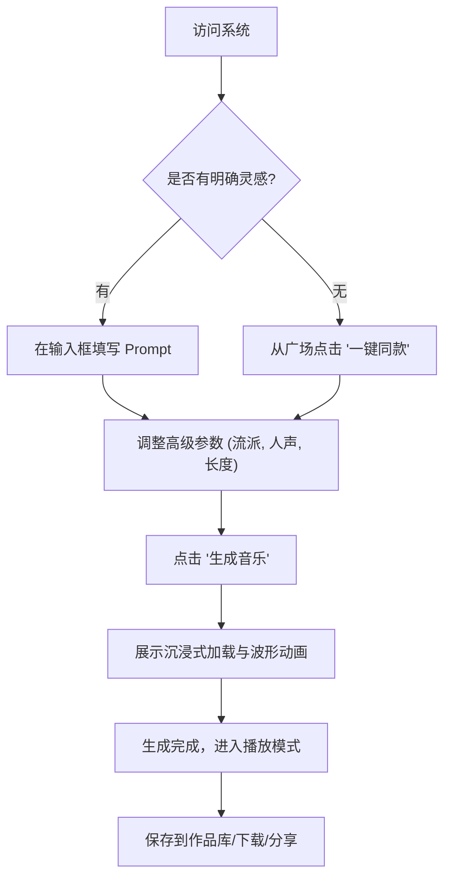

## 1. 产品概述
一款前卫且极具设计感的AI音乐在线生成系统。
- 允许用户通过简单的文字描述（Prompt）、情感标签或音乐流派，快速生成高质量的音乐片段和完整歌曲。
- 解决普通用户没有乐理知识、无法创作音乐的痛点，为视频创作者、播客、游戏开发者以及音乐爱好者提供即兴创作的工具。
- 产品的核心价值在于降低音乐创作门槛，并通过极具未来感和沉浸式的用户体验，让用户在创作过程中获得愉悦感。

## 2. 核心功能

### 2.1 用户角色
| 角色 | 注册方式 | 核心权限 |
|------|----------|----------|
| 访客 | 无需注册 | 浏览广场上的热门生成作品、体验基础的生成功能片段（受限） |
| 创作者 | 邮箱/社交账号登录 | 无限制生成音乐、管理个人作品库、下载高品质音频文件 |

### 2.2 功能模块
1. **首页 (Home)**: 沉浸式的生成入口、热门AI音乐流、动态背景与交互式波形。
2. **创作台 (Studio)**: 复杂的提示词编辑器、流派/BPM/情感选择器、生成进度可视化、多轨预览。
3. **探索广场 (Explore)**: 瀑布流展示社区优秀作品，支持点赞、播放和一键同款生成。
4. **我的作品库 (Library)**: 历史生成记录管理、音频可视化播放器、下载和分享功能。

### 2.3 页面详情
| 页面名称 | 模块名称 | 功能描述 |
|----------|----------|----------|
| 首页 | 英雄区域 (Hero) | 巨大的输入框，引导用户输入灵感，配合随着声音跳动的动态背景视觉效果。 |
| 首页 | 热门推荐 | 滚动展示最近生成的高质量曲目，悬浮即可预览播放。 |
| 创作台 | 控制面板 | 提供文本框输入歌词或提示词，侧边栏提供曲风、人声类型、BPM等高级选项的滑块与选择器。 |
| 创作台 | 播放与波形 | 生成后立即展示自定义音频播放器，带有实时音频波形可视化效果和歌词同步滚动。 |
| 作品库 | 列表视图 | 以卡片形式展示历史记录，支持按时间、流派筛选，提供批量下载或删除功能。 |

## 3. 核心流程
用户通过输入灵感、调整参数，触发AI模型进行音乐生成，并在生成完成后进行试听和管理。

## 4. 界面设计

### 4.1 设计风格
- **整体基调**: 赛博朋克 / 未来主义 / 暗黑高级感（Dark Mode First）。
- **主次色调**: 极深色背景（如 `#0A0A0C`），辅以高饱和度的霓虹强调色（如电光蓝 `#00F0FF`、荧光紫 `#B026FF`）。
- **按钮样式**: 带有轻微发光（Glow）效果、半透明磨砂玻璃质感（Glassmorphism），悬停时有强烈的色彩反馈和微小缩放。
- **字体**: 使用极具科技感的无衬线字体（如 Space Grotesk 或 Syncopate）作为标题，正文使用高可读性的无衬线字体（如 Inter）。
- **布局风格**: 大面积留白、不对称的卡片布局、网格系统，打破传统的对齐方式，增加空间感。
- **动效**: 页面切换和元素出现使用平滑的弹性动画（Spring animations），播放音乐时背景有与音频联动的光影效果。

### 4.2 页面设计概览
| 页面名称 | 模块名称 | UI 元素 |
|----------|----------|---------|
| 首页 | 英雄区域 | 居中大标题，发光的渐变输入框，动态的光晕背景，平滑的入场动画。 |
| 创作台 | 参数侧边栏 | 极简风格的滑动条，发光的单选按钮，毛玻璃背景面板。 |
| 全局 | 播放器悬浮窗 | 底部或右下角悬浮的迷你播放器，包含播放/暂停、进度条、动态音频条形图。 |

### 4.3 响应式
桌面端优先，提供最完整的沉浸式控制台体验；移动端进行触控优化，将复杂的侧边栏参数收纳为底部抽屉（Bottom Sheet），保持核心的生成输入框在视野中心。
