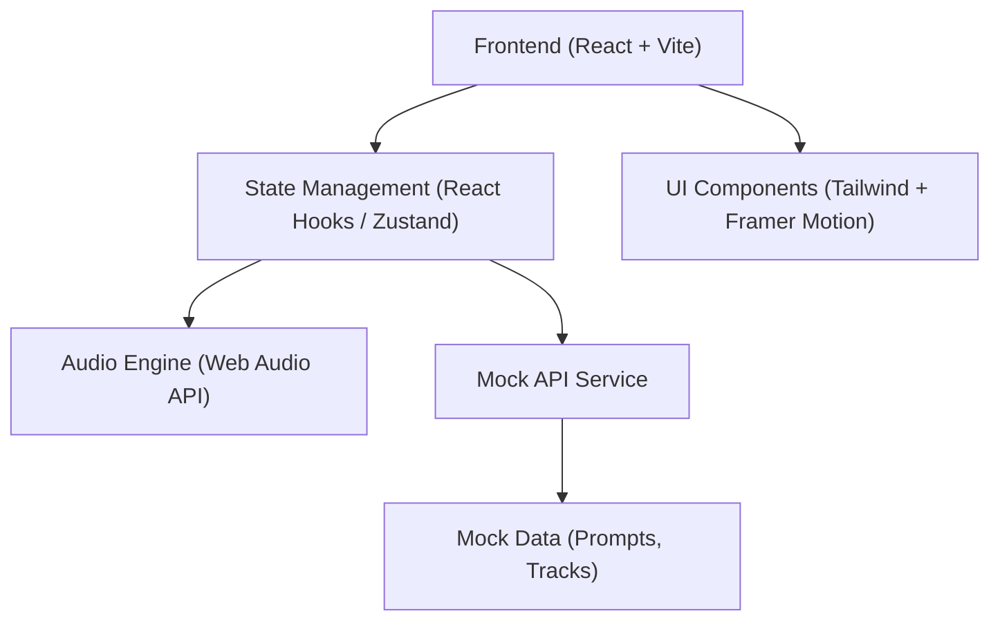
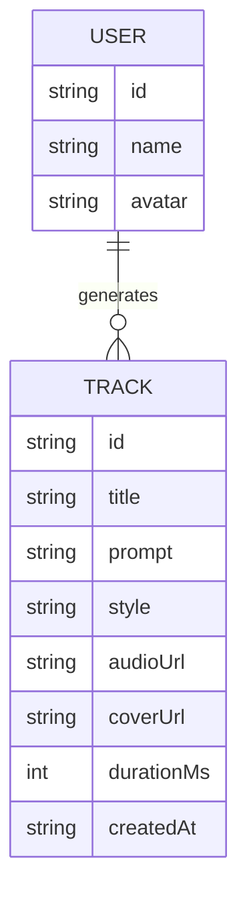

## 1. 架构设计
本系统为纯前端在线生成系统的展示与体验层（AI音乐生成后端以Mock/模拟API代替）。
采用前后端分离架构，前端处理复杂的UI交互、状态管理和音频可视化。



## 2. 技术说明
- **前端框架**: React@18 + vite
- **样式方案**: tailwindcss@3 (搭配任意所需的设计系统工具)
- **动画库**: framer-motion (用于页面过渡、复杂交互和音频联动动画)
- **图标库**: lucide-react
- **音频处理**: 原生 Web Audio API (用于音频波形提取和可视化)
- **路由管理**: react-router-dom
- **状态管理**: Zustand (用于全局播放器状态和生成队列管理)

## 3. 路由定义
| 路由 | 用途 |
|------|------|
| `/` | 首页：引导语、输入框、热门推荐展示 |
| `/studio` | 创作台：复杂的参数配置、生成控制、实时生成进度和试听 |
| `/explore` | 探索广场：瀑布流展示其他用户的生成作品 |
| `/library` | 我的作品库：个人生成的历史记录和收藏 |

## 4. API 定义 (Mock 服务)
为了展示完整的前端流程，系统将包含以下模拟接口。

### 4.1 生成音乐接口
- **POST** `/api/generate`
- **Request**:
  ```typescript
  interface GenerateRequest {
    prompt: string;
    style: string;
    vocalType: 'male' | 'female' | 'instrumental';
    duration: 'short' | 'full';
  }
  ```
- **Response**:
  ```typescript
  interface GenerateResponse {
    taskId: string;
    status: 'processing' | 'completed';
    estimatedTime: number; // 预计剩余秒数
  }
  ```

### 4.2 轮询生成状态
- **GET** `/api/task/:taskId`
- **Response**:
  ```typescript
  interface TaskStatusResponse {
    taskId: string;
    status: 'processing' | 'completed' | 'failed';
    progress: number; // 0-100
    track?: TrackData;
  }
  ```

## 5. 数据模型
用于前端状态管理和Mock数据的核心实体定义。

### 5.1 数据模型定义

